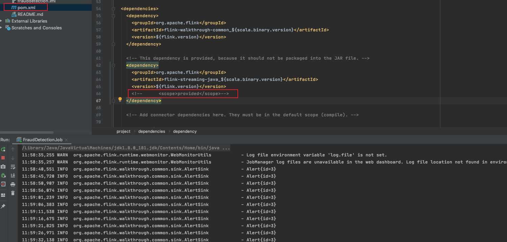

来自于[官方的例子](https://ci.apache.org/projects/flink/flink-docs-release-1.10/zh/getting-started/walkthroughs/datastream_api.html)。

```
$ mvn archetype:generate \
    -DarchetypeGroupId=org.apache.flink \
    -DarchetypeArtifactId=flink-walkthrough-datastream-java \
    -DarchetypeVersion=1.10.0 \
    -DgroupId=frauddetection \
    -DartifactId=frauddetection \
    -Dversion=0.1 \
    -Dpackage=spendreport \
    -DinteractiveMode=false
```


### TODO 疑问：

一分钟之内的异常交易，才被算作欺诈。但是从源码org.apache.flink.walkthrough.common.source.TransactionIterator中看到，这里的时间，都是加了 六分钟的。

```
public Transaction next() {
    Transaction transaction = (Transaction)data.get(this.index++);
    transaction.setTimestamp(this.timestamp);
    this.timestamp += 360000L;
    return transaction;
}
```


