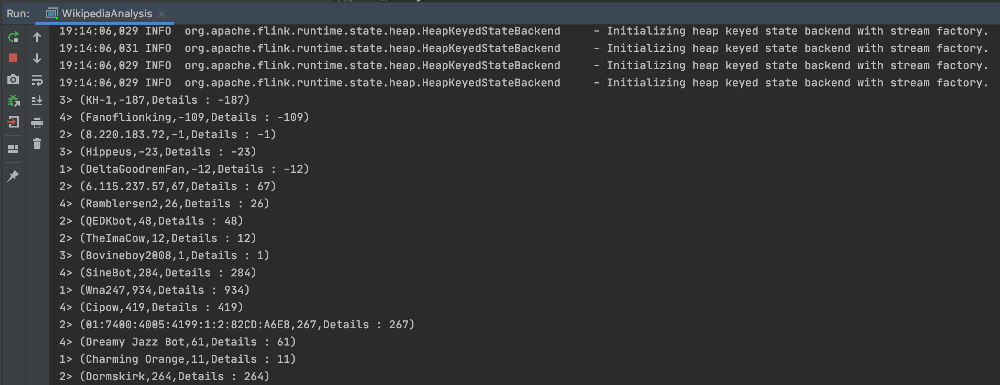

### 消息来源

消息的DataSource是个名为WikipediaEditsSource的类，这里面建立了到irc.wikimedia.org的Socker连接，再通过Internet Relay Chat (IRC) 协议接收对方的数据，收到数据后保存在阻塞队列中，通过一个while循环不停的从队列取出数据，再调用SourceContext的collect方法，就在Flink中将这条数据生产出来了；

IRC是应用层协议，更多细节请看：https://en.wikipedia.org/wiki/Internet_Relay_Chat

关于WikipediaEditsSource类的深入分析，请参考《[Flink数据源拆解分析(WikipediaEditsSource)](http://mp.weixin.qq.com/s?__biz=Mzg5MDIyODcyOQ==&mid=2247484533&idx=1&sn=debffd98997e7cb088b7e295c64c48a4&chksm=cfde9ee3f8a917f597f762465db0c4e0c419cdb5c9f0434f729d3632d6dae3b9ce697f7b1215&scene=21#wechat_redirect)》

### 实战简介

本次实战就是消费上述消息，然后统计每个用户十五秒内所有的消息，将每次操作的字节数累加起来，就得到用户十五秒内操作的字节数总和，并且每次累加了多少都会记录下来并最终和聚合结果一起展示；

### 和官网demo的不同之处

和官网的demo略有不同，官网用的是Tuple2来处理数据，但我这里用了Tuple3，多保存了一个StringBuilder对象，用来记录每次聚合时加了哪些值，这样在结果中通过这个字段就能看出来这个时间窗口内每个用户做了多少次聚合，每次是什么值：

官网的后面，将数据写入到了 kafka中，实验这里，仅仅只是打印出结果。

参考：
1、https://mp.weixin.qq.com/s/m5xvxKgxIncAKqv_VFiJFQ
2、https://ci.apache.org/projects/flink/flink-docs-release-1.2/quickstart/run_example_quickstart.html